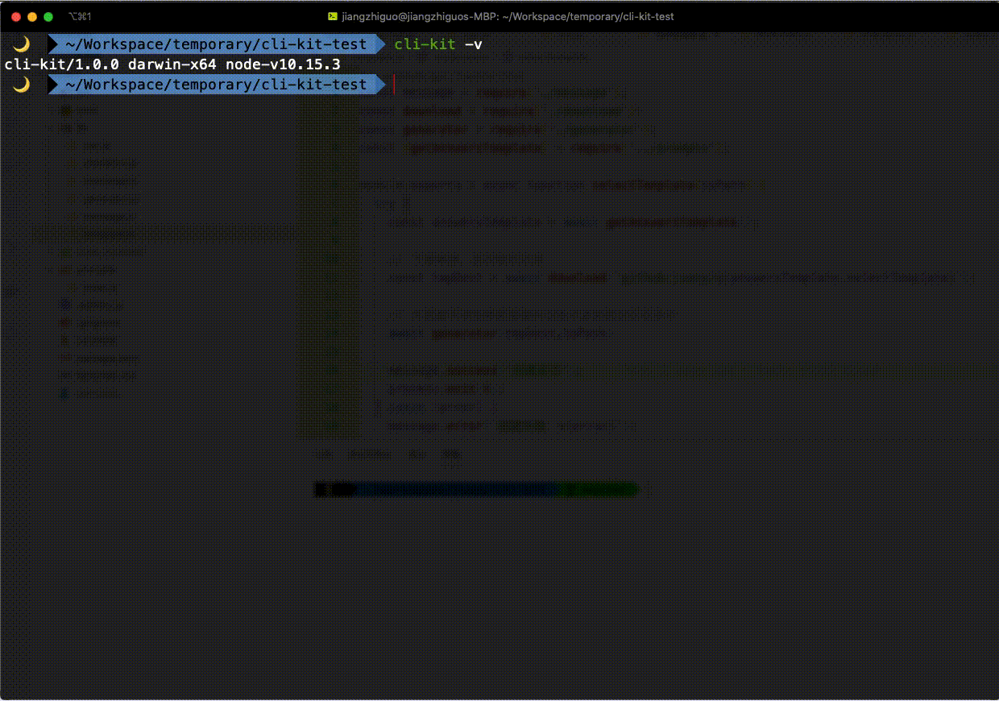

<h1 align="center">Welcome to cli-kit 👋</h1>
<p>
  <a href="https://www.npmjs.com/package/@jsany/cli-kit" target="_blank">
    
  </a>
  <a href="https://www.npmjs.com/package/@jsany/cli-kit" target="_blank">
    
  </a>
  <a href="https://www.npmjs.com/package/@jsany/cli-kit" target="_blank">
    
  </a>
  <a href="https://github.com/jsany/cli-kit#readme" target="_blank">
    
  </a>
  <a href="https://github.com/jsany/cli-kit/graphs/commit-activity" target="_blank">
    
  </a>
  <a href="https://github.com/jsany/cli-kit/blob/main/LICENSE" target="_blank">
    
  </a>
</p>

> The scaffold demo for the future

原理：<https://github.com/jsany/cli-theory>



## Features

- [x] typescript
- [x] eslint、prettier、commitlint
- [x] local template
- [x] remote template
- [x] use config first

## Prerequisites

- node >=10

## Config

when `npm install` in lifecyle of `postinstall` will copy `.clikitrc.json` to `$HOME/.clikitrc.json`, then use it first, you can edit this json file what you wanna

### Fields

- githubToken: String - personal github token, default is `''`
- localTemplates: Object - local template
  - name: String - it must `root/templates` first level subdirectory name
  - message: String - about this template description, it will appear in prompt
- remoteTemplates: Object - remote template
  - name: String - it must repository([go rules detail](https://www.npmjs.com/package/download-git-repo#repository))
  - message: String - about this template description, it will appear in prompt
  - bootstrap: Object - it will assign top default bootstrap
- bootstrap: Object - it will run after project generate
  - npm: Array - npm cmd, like `npm i`
  - git: Array - git cmd, like `git init`
  - open: Array - open cmd(ide), like `code .`

`.clikitrc.json` default is:

```json
{
  "githubToken": "",
  "localTemplates": [
    {
      "name": "template-a",
      "message": "Project A(template-a)"
    },
    {
      "name": "template-b",
      "message": "Project B(template-b)"
    }
  ],
  "remoteTemplates": [
    {
      "name": "github:jsany/template-main",
      "message": "The main project(template-main)"
    },
    {
      "name": "github:jsany/template-secondary",
      "message": "The secondary project(template-secondary)"
    },
    {
      "name": "github:jsany/template-lerna",
      "message": "The mono project(template-lerna)",
      "bootstrap": {
        "npm": ["yarn"]
      }
    }
  ],
  "bootstrap": {
    "npm": ["npm install"],
    "git": ["git init"],
    "open": ["code ."]
  }
}

```

## Usage

### Install

```sh
git clone https://github.com/jsany/cli-kit.git
cd cli-kit && yarn install
```

### Build

```sh
yarn build
```

### Link

```sh
yarn link
```

It already publish to npm, so you can `npm i -g @jsany/cli-kit` instead of above step, of course it is suggested as template or demo, base it diy yourself

```sh
cli-kit init
```

```sh
cli-kit info
```

```sh
cli-kit config
```

## Show your support

Give a ⭐️ if this project helped you!

***
_This README was generated with ❤️ by [readme-md-generator](https://github.com/kefranabg/readme-md-generator)_
